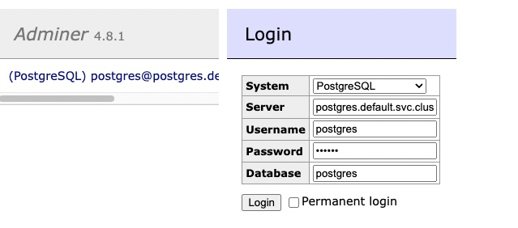
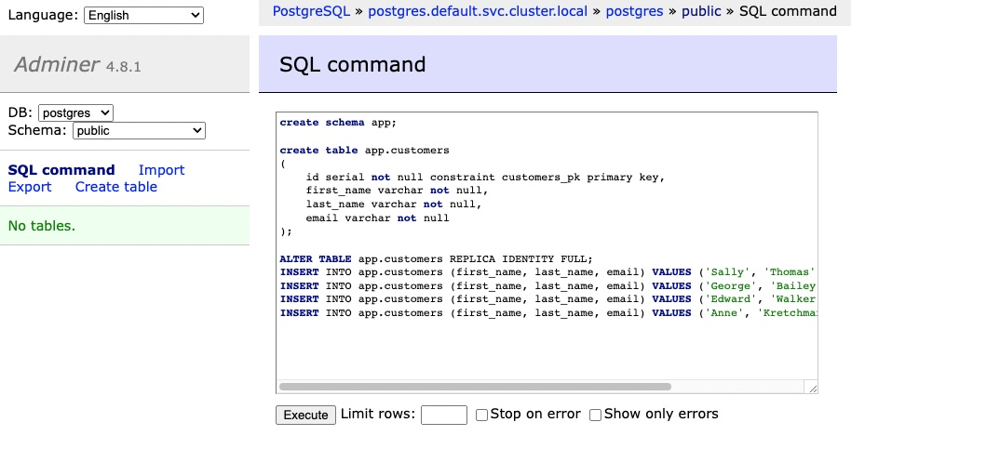
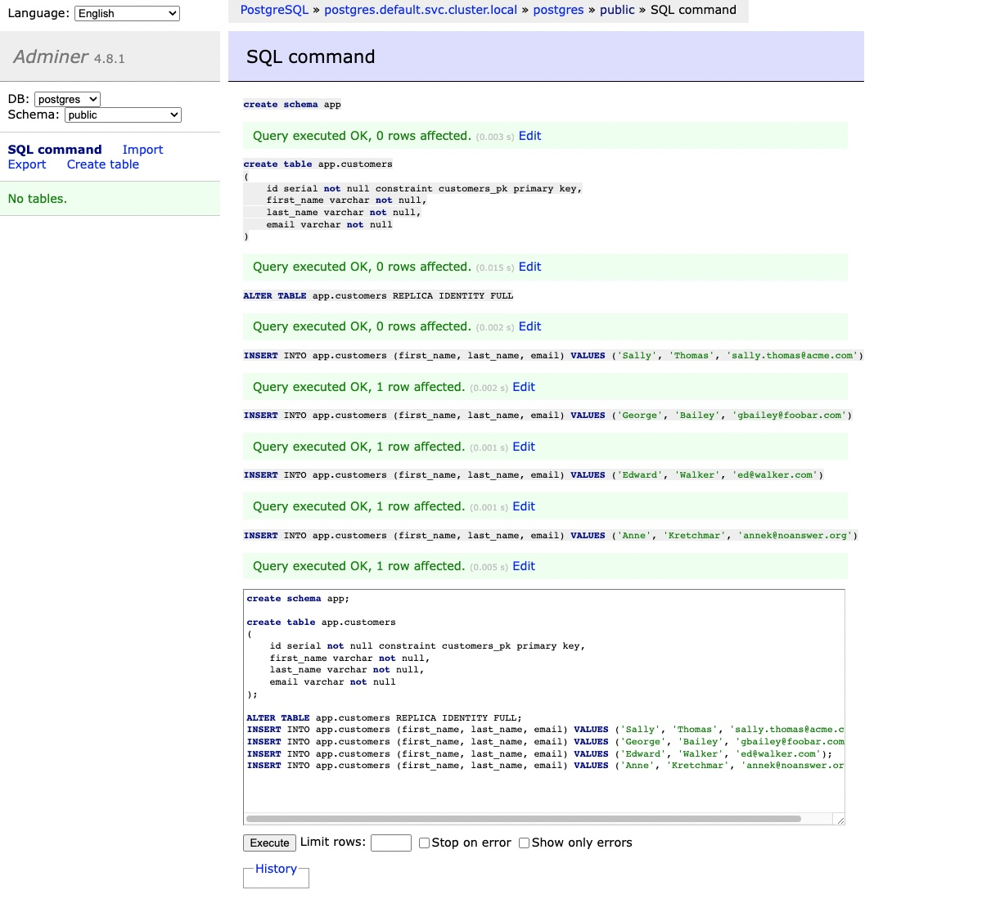
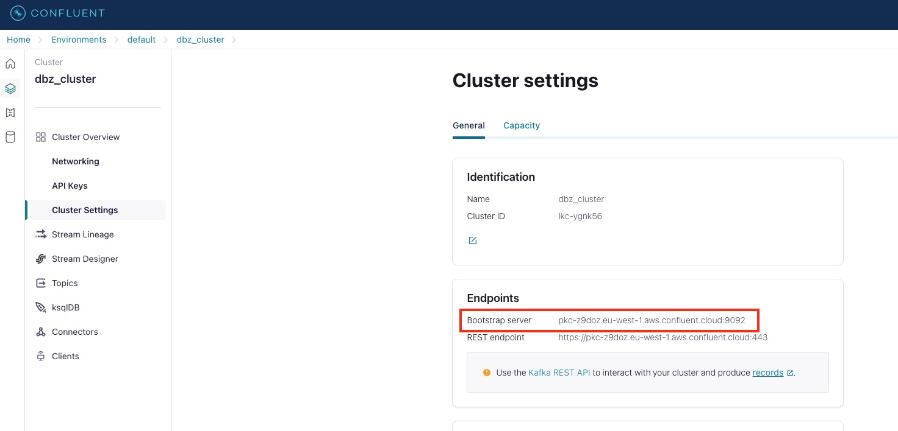
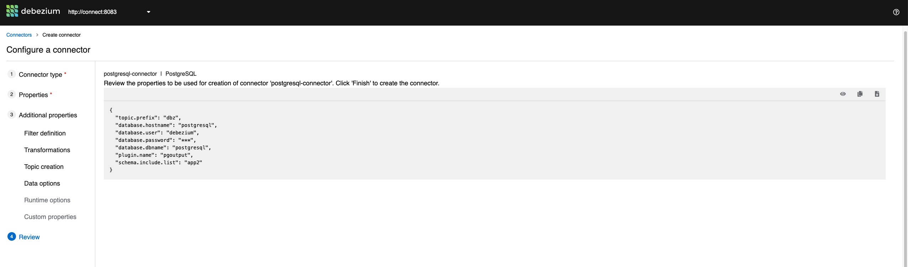
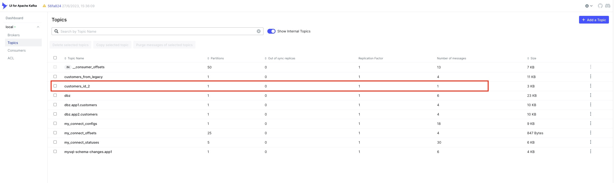

# Debezium Starter Kit
In this repository you'll find different pre-built examples to start to work with Debezium


## (NEW!!!) Features (Debezium in Kubernetes)

- **Debezium 2.3.2 Kubernetes deployment**

​		Example of replication between Postgresql and Confluent Cloud. 


<br/>

## Features (implemented using Docker Compose)

The features implemented are the following ones:

- **Simple replication**

  Example to implement a simple replication between two sources (MySQL and Postgresql) and Kafka. Besides that, a simple transformation and a transformation chain is also included

- **Transformations**

  Example to implement a simple transformation and a transformation chain

- **Replication using Avro and Confluent Schema Registry**

  Example of replication between two sources (MySQL and Postgresql) and Kafka using Avro and Confluent Schema Registry

- **Replication using Avro and Apicurio Schema Registry (Red Hat)**

  Example of replication between two sources (MySQL and Postgresql) and Kafka using Avro and Apicurio Schema Registry

  

All the examples implemented using **Docker Compose** also provide these tools:

- **[Kafka UI](https://github.com/provectus/kafka-ui)**: tool to explore Kafka topics and messages sent by Debezium. This tool is running at http://localhost:9081
- **[Debezium UI](https://debezium.io/documentation/reference/operations/debezium-ui.html)**, to visualize and manage conectors. This tool will be running at http://localhost:9080
- **[Adminer](https://www.adminer.org/)**, to perform database operations directly. This tool will be running at http://localhost:8080

<br/><br/>

## Playing with Debezium

In the following sections we're going different examples using Debezium. 


### (NEW!!!) Simple replication: Kubernetes, Debezium, Postgresql and Confluent Cloud

In this example we're going to show how Debezium works, implementing a simple replication between Postgresql and Confluent Cloud, and deploying Debezium in Kubernetes.

In this example we need a distribution of Kubernetes. For that, we are going to use [K3D](https://k3d.io/v5.6.0/) but you can use Minikube or any cloud distribution like EKS, AKS, GKE, etc...


#### Creating a new K8s cluster

To create a new cluster, we have to execute this command (remember you need to install K3D before o skip this step if you are going to use other kind of K8s):

````shell
k3d cluster create --config ./infra/k3d/k3d-conf.yaml
````


Once the cluster is created you'll see something like this:

```shell
INFO[0014] Cluster 'k8s-cluster' created successfully!  
INFO[0014] You can now use it like this:                
kubectl cluster-info
```


#### Deploying Postgresql and Adminer

In this example we are going to use an "ephemeral Postgresql" deployed to Kubernetes. So, it's necessary to execute this command:

```shel
kubectl apply -f examples/dbz-2.3.2_k8s_confluentcloud/k8s-manifests/postgresql-db.yaml
```


In this deployment, we are also going to deploy **[Adminer](https://www.adminer.org/)**, to perform database operations directly. So, go to http://localhos:8080 :



Enter the connection values:

- Engine: Postgresql
- Server: postgres.default.svc.cluster.local
- User: postgres
- Password: pgpass
- Database: postgres


Then, click en SQL Command and paste this script:

```sql
create schema app;

create table app.customers
(
    id serial not null constraint customers_pk primary key,
    first_name varchar not null,
    last_name varchar not null,
    email varchar not null
);

ALTER TABLE app.customers REPLICA IDENTITY FULL;
INSERT INTO app.customers (first_name, last_name, email) VALUES ('Sally', 'Thomas', 'sally.thomas@acme.com');
INSERT INTO app.customers (first_name, last_name, email) VALUES ('George', 'Bailey', 'gbailey@foobar.com');
INSERT INTO app.customers (first_name, last_name, email) VALUES ('Edward', 'Walker', 'ed@walker.com');
INSERT INTO app.customers (first_name, last_name, email) VALUES ('Anne', 'Kretchmar', 'annek@noanswer.org');
```




Click on "**Execute**":




#### Confluent Cloud 

##### Bootstrap server

The URL of the bootstrap server is in the "Cluster Settings" section:




We have to copy the url and paste it to the file "*examples/dbz-2.3.2_k8s_confluentcloud/k8s-manifests/dbz-kafka-connect.yaml*":


##### API Key

In this example you need a Confluent Cloud cluster and an API Key. To create a new API Key, go to "API Keys" section and click on "Create key":


We select "Global Access" and "Next" to create the API Key:


We have to copy the key and secret and replace them in the file "*examples/dbz-2.3.2_k8s_confluentcloud/k8s-manifests/dbz-kafka-connect.yaml*"


#### Deploying Debezium (Kafka Connect) in Kubernetes

Now, it's time to deploy Debezium to Kubernetes. To do that, execute:

```shell
kubectl apply -f examples/dbz-2.3.2_k8s_confluentcloud/k8s-manifests/dbz-kafka-connect.yaml
```


We have to wait for the pod be ready (it takes one or two minutes)...Once the pod is ready, you can check that the "control topics" are created:


Now, we have to register the connector to start to replicate data to Postgresql to Confluent Cloud. First, we have to do a port forward to get the pod:

```shell
kubectl port-forward --namespace default svc/dbz-kafkaconnect-srv 8083:8083
```


Then, in other console, execute:

```shell
curl -i -X POST -H "Accept:application/json" -H  "Content-Type:application/json" "http://localhost:8083/connectors/" -d @examples/dbz-2.3.2_k8s_confluentcloud/connectors/postgresql-connector.json
```


The result should be similar to this:

```bash
HTTP/1.1 201 Created
Date: Tue, 05 Sep 2023 16:35:57 GMT
Location: http://localhost:8083/connectors/postgresql-connector
Content-Type: application/json
Content-Length: 583
Server: Jetty(9.4.48.v20220622)

{"name":"postgresql-connector","config":{"connector.class":"io.debezium.connector.postgresql.PostgresConnector","tasks.max":"1","database.hostname":"postgres.default.svc.cluster.local","database.port":"5432","database.user":"postgres","database.password":"pgpass","database.dbname":"postgres","schema.include.list":"app","topic.prefix":"cdc","publication.autocreate.mode":"filtered","slot.name":"debezium","topic.creation.enable":"true","topic.creation.default.replication.factor":"3","topic.creation.default.partitions":"1","name":"postgresql-connector"},"tasks":[],"type":"source"}%
```


Now, if we go to Confluent Cloud to check the topics, we'll see a new topic containg the data from Postgresql:


And, if we check the messages, we can see the data from Postgresql:


Now, for instance, we are going to change in Postgresql the last name of this record. We change "Kretchmar" to "Kretchmar Updated":


If we go back to Confluent Cloud and check the messages in the CDC topic, we'll see a new message containing the change:

 


#### Destroying the K8s cluster

To destroy the K8s cluster execute:

```shell
k3d cluster delete k8s-cluster
```


### Simple replication

In this example we're going to show how Debezium works, implementing a simple replication from two sources (MySQL and Postgresql) and Kafka. As I said in the setup section, to create the infrastucture, execute:

````shell
cd examples/simple
sh setup_infra.sh
````


Once the containers are up and running, you can register all the connector using the script defined in "*examples/simple/register_connectors.sh*" and skip the following section or, if you want to see in detail how to work with Debezium and to register connectors, keep reading.


#### Registering connectors

if we open [Debezium UI](http://localhost:9080), we'll see that there is no connectors registered:


If we also open Kafka UI, we'll see there are no topics related to Debezium. We will only see some topics related to Kafka Connect::


 Now, we're going to register some connectors. To do that, we'll use two different ways to register connectors:

- By using the Kafka Connect API (Rest)
- By using [Debezium UI](http://localhost:9080)

<br/>

##### MySQL connector
We'll use the API instead of Debezium UI. Connectors are defined by a JSON file where we indicate some configuration properties. The file associated to our MySQL connector is placed at "examples/simple/connectors/register-mysql.json":

````shell
{
  "name": "mysql-connector",
  "config": {
    "connector.class": "io.debezium.connector.mysql.MySqlConnector",
    "database.hostname": "mysql",
    "database.port": "3306",
    "database.user": "debezium",
    "database.password": "dbz",
    "database.server.id": "184054",
    "database.include.list": "app1",
    "topic.prefix": "dbz",
    "schema.history.internal.kafka.bootstrap.servers": "kafka:9092",
    "schema.history.internal.kafka.topic": "mysql-schema-changes.app1"
  }
}
````

If you want to get more info about the different properties, check [MySQL connector documentation at Debezium](https://debezium.io/documentation/reference/1.7/connectors/mysql.html#mysql-connector-properties).

Once we've defined the configuration file associated to our connector (MySQL), we register it by calling to Kafka Connect Rest API executing this command from "examples/simple" folder:

````shell
curl -i -X POST -H "Accept:application/json" -H  "Content-Type:application/json" http://localhost:8083/connectors/ -d @connectors/register-mysql.json
````


If the operation is correct, we'll get a "201 status" response and the location of the connector (http://localhost:8083/connectors/mysql-connector):

````shell
HTTP/1.1 201 Created
Date: Mon, 11 Oct 2021 10:14:12 GMT
Location: http://localhost:8083/connectors/mysql-connector
Content-Type: application/json
Content-Length: 479
Server: Jetty(9.4.39.v20210325)

{"name":"mysql-connector","config":{"connector.class":"io.debezium.connector.mysql.MySqlConnector","tasks.max":"1","database.hostname":"mysql","database.port":"3306","database.user":"debezium","database.password":"dbz","database.server.id":"184054","database.server.name":"mysql","database.include.list":"app1","database.history.kafka.bootstrap.servers":"kafka:9092","database.history.kafka.topic":"mysql-schema-changes.app1","name":"mysql-connector"},"tasks":[],"type":"source"}
````


We can also check if the connector is registered and it's running by accesing to [Debezium UI](http://localhost:9080):


When the connector starts, it gets an snapshot of the information existing in the tables configured in the JSON file ("database.include.list": "app1") and sends the messages associated to that snapshot to Kafka. If we go to [Kafka UI](http://localhost:9081), we'll see new topics: 


The topic containing the snapshot is "dbz.app1.customers". If we check the messages in this topic, we'll get four messages. Each message is generated from each row:


<br/>

##### Making changes in MySQL to generate events

To check how Debezium manages changes we're going to make some changes in MySQL data. To perform these actions we'll use [Adminer](http://localhost:8080). To connect to MySQL, we'll need this information:

- Server: mysql
- User / Pass: user1 / user1
- Database: testdb


Once we've connected to MySQL, we're going to add a new register:


and then, we'll modify another one adding "(Updated)" to the "first_name" data:


If everything is Ok (sure it is), Debezium will get those two changes and it'll send them to Kafka. To check it, we access to [Kafka UI](http://localhost:9081/) and open the topic "mysql.app1.customers". We'll see that there are two messages more. 

The first one is associated to the insert action. In the payload of the message we can check the type of the operation ("op: 'c'") and the content of the new registry("After"):


The second one is associated to the update action. If we examine the payload, we'll see that the operation is "update" (op: u) and, in update operations we can get the content before the update action ("Before") and the content after the update action ("After"):


Now, you can keep making changes to see how Debezium works with the different operations.

<br/><br/>

#### Using Debezium UI to register a connector

In this case, instead of using the Kafka Connect Rest API, we're going to use Debezium UI to register a connector to replicate changes from Postgresql to Kafka. The first step is to open [Debezium UI](http://localhost:9080/) and click into "Create a Conector" to start the wizard. We select "PostgreSQL" as connector type and click "Next":


Now, we have to fill the connector configuration data:

- **Connector name**: postgresql-connector
- **Topic prefix**: dbz
- **Namespace**: postgresql
- **Hostname**: postgresql
- **Port**: 5432
- **User**: debezium
- **Password**: dbz
- **Database**: postgresql

You can also get them from the file "examples/simple/connectors/register-postgresql.json" (if we would want to register the connector calling the Kafka Connect Rest API as we did with the MySQL connector, we'd use this json file).

We have to open "Advanced Properties" panel and choose "pgoutput" as plugin because we are using a "raw" Postgresql in this repository, without libs requested by the other plugins;


Then, we click "Validate". If everything is OK, the next step is to select which schemas and tables are we going to replicate. We write "app2" for the schema because we want to capture all the tables in that schema. Then, click "Apply" to consolidate the information:


Then, we have to click "Review and Finish" to go to the final step: 




Click "Finish" to finally create the connector. We should have now two connectors running: the previous one to replicate data from MySQL and this one, to replicate data from Postgresql:


Besides that, if we go to [Kafka UI](http://localhost:9081/), we'll find a new topic, "postgresql.app2.customers", containing four messages. As  que contiene cuatro mensajes y que, al igual que en el caso de MySQL, son los correspondientes al snapshot inicial de la información que existe en la tabla "customers"


<br/>

##### Making changes in Postgresql

As we did in the section related to MySQL, we're going to use [Adminer](http://localhost:8080) to make changes in Postgresql to see how Debezium works. We need to introduce the following data to connect to Postgresql:

- Server: postgresql
- User / Pass: user2 / user2
- Database: postgresql


Then, we must select the schema "app2":


Now, we're going to add a new register and to modify another one. To insert a new row, click on "Nuevo Registro":


Fill all the fields and save:


Then, we modify another one, adding "(Updated)" to "first_name":


If everything is ok, Debezium will send these changes to Kafka. To check it, go to [Kafka UI](http://localhost:9081/), open the topic "postgresql.app2.customers" and you'll find two new messages:


The first one was generated from the insert action ("op:c"). The data of the new register is in the "After" property:


The second one was generated from the update action ("op: u") and we can find the data before the update action ("Before" property) and after the action ("After" property):


### Transformations

#### Simple transformation

We're going to register a new connector to make a simple routing transformation, sending changes in Postgresql to the custom topic "customers_from_legacy" instead of "postgresql.app2.customers". To perform this transformation we need to add the following lines to the previous Postgresql connector:

````shell
"transforms": "Reroute",
"transforms.Reroute.type": "io.debezium.transforms.ByLogicalTableRouter",
"transforms.Reroute.topic.regex": "postgresql.app2.customers",
"transforms.Reroute.topic.replacement": "customers_from_legacy"
````


In these lines we are configuring: 

- "transforms": in this property we specify the list of the transformations we are going to do. In our case, just one: "Reroute"
- "transforms.Reroute.type": we configure that the type of the "Reroute" transformation is "io.debezium.transforms.ByLogicalTableRouter". 
- "transforms.Reroute.topic.regex": this property is used to set the regular expression to match the current topic where changes are sent. So, all the messages sent to the topics matching the expression will be sent to the custom topic instead of the current one. In our case, "postgresql.app2.customers"
- "transforms.Reroute.topic.replacement": this property defines the custom topic where the messages will be sent. In our case, "customers_from_legacy"

The complete JSON file is located at "examples/transformations/connectors/register-postgresql-with-topic-routing.json". In order to register, we can execute the script to register all the connectors ("examples/transformations/register_connectors.sh") or we can execute this sentence to register just this one (from "examples/transformations" folder):

````shell
curl -i -X POST -H "Accept:application/json" -H  "Content-Type:application/json" http://localhost:8083/connectors/ -d @connectors/register-postgresql-with-topic-routing.json
````


The result should be a 201 http status:

```shell
HTTP/1.1 201 Created
Date: Wed, 13 Oct 2021 15:37:39 GMT
Location: http://localhost:8083/connectors/postgresql-connector-with-topic-routing
Content-Type: application/json
Content-Length: 701
Server: Jetty(9.4.39.v20210325)

{"name":"postgresql-connector-with-topic-routing","config":{"connector.class":"io.debezium.connector.postgresql.PostgresConnector","tasks.max":"1","database.hostname":"postgresql","database.port":"5432","database.user":"debezium","database.password":"dbz","database.dbname":"postgresql","database.server.name":"postgresql","schema.include":"app2","plugin.name":"pgoutput","publication.autocreate.mode":"filtered","transforms":"Reroute","transforms.Reroute.type":"io.debezium.transforms.ByLogicalTableRouter","transforms.Reroute.topic.regex":"(.*)customers(.*)","transforms.Reroute.topic.replacement":"customers_from_legacy","name":"postgresql-connector-with-topic-routing"},"tasks":[],"type":"source"}%
```


We can also check it in the [Debezium UI](http://localhost:9080/)::


And, if we go to [Kafka UI](http://localhost:9081/) we'll see that the new topic "customers_from_legacy" is created and if we click on it to see its messages, we'll see some messages associated to the initial table snapshot:


Now, if we make changes in Postgresql, Debezium will send the messages associated to those changes to the topic "customers_from_legacy". As the previous Postgresql connector is also running, message will sent to the topic "postgresql.app2.customers" too.


### Transformation chain

Now, we're going to configure a transformation chain:

1) Get only changes with "id" equal to 2
2) Send those changes with "id" equal to 2 to the custom topic "customers_id_2"

To configure these transformations we need to include these lines in the first Postgresql connector:

```json
"transforms": "FilterById, RerouteCustomTopic",
"transforms.FilterById.type": "io.debezium.transforms.Filter",
"transforms.FilterById.language": "jsr223.groovy",
"transforms.FilterById.condition": "value.after.id == 2",
"transforms.RerouteCustomTopic.type": "io.debezium.transforms.ByLogicalTableRouter",
"transforms.RerouteCustomTopic.topic.regex": "dbz.app2.customers",
"transforms.RerouteCustomTopic.topic.replacement": "customers_id_2"
```

<br/>

In these lines we are configuring: 

- "transforms": we set two transformations, and we called "FilterById" and  "RerouteCustomTopic"
- "transforms.**FilterById**.type": we configure the type of the first one: "io.debezium.transforms.Filter". 
- "transforms.**FilterById**.language": in this property we say that we are going to define the filter condition using Groovy ("jsr223.groovy")
- "transforms.**FilterById**.condition": this is the filter condition ("value.after.id == 2") that is take the content value and then, examine the property "id" to the "After" node
- "transforms.**RerouteCustomTopic**.type": we configure that the type of the "RerouteCustomTopic" transformation is "io.debezium.transforms.ByLogicalTableRouter". 
- "transforms.**RerouteCustomTopic**.topic.regex": this property is used to set the regular expression to match the current topic where changes are sent. So, all the messages sent to the topics matching the expression will be sent to the custom topic instead of the current one. In this case, "dbz.app2.customers"
- "transforms.**RerouteCustomTopic**.topic.replacement": this property defines the custom topic where the messages will be sent. In this case, "customers_id_2"

The complete JSON file is located at "*examples/transformations/connectors/register-postgresql-with-message-filtering-and-topic-routing.json*". 

In order to register, we can execute the script to register all the connectors ("*examples/transformations/register_connectors.sh*") or we can execute this sentence to register just this one (from "*examples/transformations*" folder):

````shell
curl -i -X POST -H "Accept:application/json" -H  "Content-Type:application/json" http://localhost:8083/connectors/ -d @connectors/register-postgresql-with-message-filtering-and-topic-routing.json
````


We should receive a 201 status code:

````shell
HTTP/1.1 201 Created
Date: Thu, 14 Oct 2021 09:05:43 GMT
Location: http://localhost:8083/connectors/register-postgresql-with-message-filtering-and-topic-routing
Content-Type: application/json
Content-Length: 990
Server: Jetty(9.4.39.v20210325)

{"name":"register-postgresql-with-message-filtering-and-topic-routing","config":{"connector.class":"io.debezium.connector.postgresql.PostgresConnector","tasks.max":"1","database.hostname":"postgresql","database.port":"5432","database.user":"debezium","database.password":"dbz","database.dbname":"postgresql","database.server.name":"postgresql","schema.include":"app2","plugin.name":"pgoutput","publication.autocreate.mode":"filtered","slot.name":"debezium3","transforms":"FilterById, RerouteCustomTopic","transforms.FilterById.type":"io.debezium.transforms.Filter","transforms.FilterById.language":"jsr223.groovy","transforms.FilterById.condition":"value.after.id == 2","transforms.RerouteCustomTopic.type":"io.debezium.transforms.ByLogicalTableRouter","transforms.RerouteCustomTopic.topic.regex":"postgresql.app2.customers","transforms.RerouteCustomTopic.topic.replacement":"customers_id_2","name":"register-postgresql-with-message-filtering-and-topic-routing"},"tasks":[],"type":"source"}%
````


If we go to  [Debezium UI](http://localhost:9080/) we'll find the new connector:


And if we go to the [Kafka UI](http://localhost:9081/), we'll see that there is a new topic "customers_id_2" containing only a message because in the snapshot data there is only a customer with id equal two:




If we modify the customer with this id (2) in Postgresql:


 and other customer with different id:


we'll see that Debezium only sends one message to the topic "customers_id_2", the one with id equal to two:


#### What do I have to keep in mind to configure transformations?

To perform transformations you need to include some libs in the Kafka Connector (for instance Groovy). In this repository, the Kafka Connect image is a custom image including these libs. You can check it in the Dockerfile (infra/docker/connect-smt/Dockerfile) 

You can find more detail in the [Debezium official doc](https://debezium.io/documentation/reference/1.7/transformations/filtering.html).


<br/>

### Using Avro

In the previous examples we've used JSON and we've not used an schema registry. If we don't configure any serializer, Debezium captures changes in the database, serializes the content using the default serializer (JSON) and sends the message to Kafka. Working with JSON messages is easier to debug but is less efficient than a binary format like Avro. In some use cases, we can need that efficiency. 

Avro messages are more compact avoiding to include the schema in the content of the message because the schema is described in the schema registry. In the following examples, we are going to use Avro working with two different schema registries. In the first example we'll use Confluent Schema Registry and in the second one, we'll use Apicurio. 


#### Debezium and Confluent Schema Registry

The code associated to this example is in the folder "*examples/avro_confluent-schema-registry*". To create the infrastructure, execute:

```shell
cd examples/avro_confluent-schema-registry
sh setup_infra.sh
```

Basically, we need to specify which converter we're going to use and where the schema registry is:

```shell
"key.converter": "io.confluent.connect.avro.AvroConverter",
"value.converter": "io.confluent.connect.avro.AvroConverter",
"key.converter.schema.registry.url": "http://schema-registry:8081",
"value.converter.schema.registry.url": "http://schema-registry:8081"
```


<br/>

## Destroying the environment

To destroy the environment execute the script "destroy_infra.sh" located in each example folder. For instance, to destroy the infra associated to the first example, execute:

````shell
sh examples/simple/destroy_infra.sh
````

