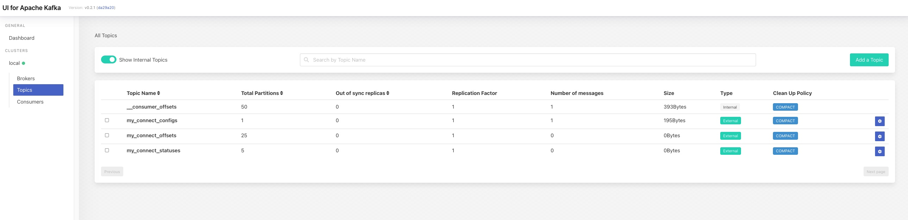
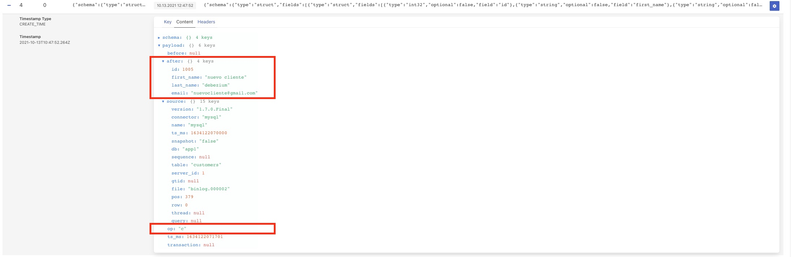
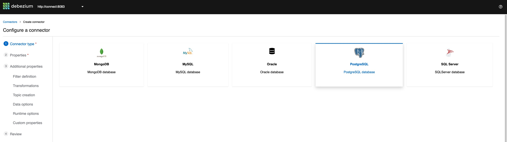
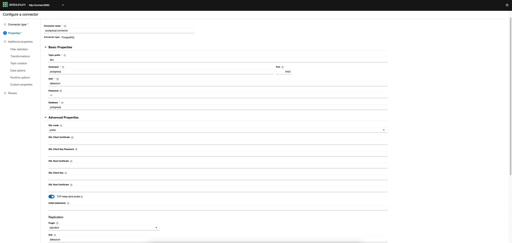
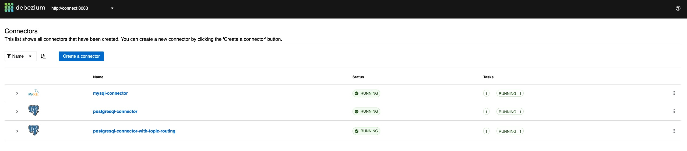
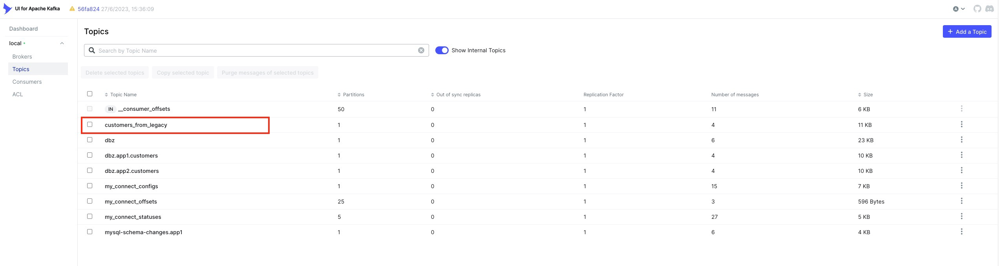

# Debezium Starter Kit
En este repositorio se puede encontrar una PoC lista para poder empezar a trabajar con Debezium. La versión seleccionada es la 1.7.

## Features
Dentro de las features que podrás encontrar en la PoC se encuentran:

- Entorno local usando Docker Compose
- Replicación desde los siguientes orígenes de datos: MySQL y Postgresql
- Kafka UI para que puedas ver los mensajes de replicación que llegan a Kafka
- Debezium UI, liberada en la versión 1.7 de Debezium, para gestionar los conectores de forma gráfica
- Adminer, para poder realizar cambios en base de datos sin necesitar ningún cliente adicional

<br/>

## Puesta en marcha

La puesta en marcha es muy sencilla. Simplemente, desde la raíz del proyecto, tienes que ejecutar:

````shell
docker-compose --env-file ./infra/config/.env up
````

** Puedes añadir el modificador "-d" si quieres que se ejecute en background.


Una vez levantado todo (tarda unos minutos) tendremos disponibles las siguientes URLs:

- Kakfa (Broker): http://localhost:9092
- Kakfa UI: http://localhost:9081
- Adminer: http://localhost:8080
- Debezium UI: http://localhost:9080
- Kafka Connect: http://localhost:8083

<br/>

<br/>

## Jugando con Debezium

En este momento tenemos levantado el entorno pero no hemos hecho nada con Debezium. 
Si accedemos a la UI de Debezium, nos dirá que no hay ningún conector registrado:


Si accedemos a la URL de KafkaUI veremos que no hay topics relacionados con replicación con Debezium. Únicamente veremos los relacionados con Kafka Connect:




En los siguientes pasos vamos a ver cómo funciona mediante un ejercicio práctico

<br/>

### Registrando el conector para MySQL
El primer paso es registrar un conector de Debezium para indicar qué queremos establecer CDC desde un orígen a Kafka. En este caso, el origen es MySQL. Los datos de configuración del conector se encuentran en el fichero "connectors/register-mysql.json":

````shell
{
  "name": "mysql-connector",
  "config": {
    "connector.class": "io.debezium.connector.mysql.MySqlConnector",
    "tasks.max": "1",
    "database.hostname": "mysql",
    "database.port": "3306",
    "database.user": "debezium",
    "database.password": "dbz",
    "database.server.id": "184054",
    "database.server.name": "mysql",
    "database.include.list": "app1",
    "database.history.kafka.bootstrap.servers": "kafka:9092",
    "database.history.kafka.topic": "mysql-schema-changes.app1"
  }
}
````


El detalle sobre las distintas propiedades la puedes encontrar en la [documentación del conector de MySQL de Debezium](https://debezium.io/documentation/reference/1.7/connectors/mysql.html#mysql-connector-properties).

Una vez que hemos definido el fichero de configuración, vamos a registrar el conector mediante el API de Kafka Connect. Para ello, lanzamos a siguiente llamada al API Rest de Kafka Connect:

````shell
curl -i -X POST -H "Accept:application/json" -H  "Content-Type:application/json" http://localhost:8083/connectors/ -d @register-mysql.json
````


Deberíamos recibir como respuesta algo como lo siguiente:

````shell
HTTP/1.1 201 Created
Date: Mon, 11 Oct 2021 10:14:12 GMT
Location: http://localhost:8083/connectors/mysql-connector
Content-Type: application/json
Content-Length: 479
Server: Jetty(9.4.39.v20210325)

{"name":"mysql-connector","config":{"connector.class":"io.debezium.connector.mysql.MySqlConnector","tasks.max":"1","database.hostname":"mysql","database.port":"3306","database.user":"debezium","database.password":"dbz","database.server.id":"184054","database.server.name":"mysql","database.include.list":"app1","database.history.kafka.bootstrap.servers":"kafka:9092","database.history.kafka.topic":"mysql-schema-changes.app1","name":"mysql-connector"},"tasks":[],"type":"source"}
````


En la respuesta nos está diciendo que el conector se ha creado correctamente (status 201) y que se ha registrado en "http://localhost:8083/connectors/mysql-connector". Si accedemos ahora al UI de Debezium veremos que nos aparece el conector y que está "running":


Podemos comprobarlo accediendo a Kafka UI. Veremos que aparecen topic nuevos: 


Si accedemos al topic "mysql.app1.customers", veremos que tiene 4 mensajes:


Estos mensajes no son cambios sino que corresponden al snapshot que ha hecho Debezium de la tabla que hemos configurado en el conector

<br/>

### Realizando cambios en MySQL

Ahora vamos a hacer cambios en MySQL para ver cómo Debezium lo replica en Kafka. Para ello, accedemos a la [consola de Adminer](http://localhost:8080) e introducimos los datos de conexión a MySQL:
- Servidor: mysql
- User / Pass: user1 / user1
- Base de datos: testdb


Una vez dentro, podemos hacer cualquier acción sobre la tabla "customers". Por ejemplo, vamos a añadir un registro:


y a editar otro, añadiendo "(Updated) en el nombre":


Si todo ha ido bien, Debezium habrá propagado los cambios a Kafka. Si volvemos ahora a [Kafka UI](http://localhost:9081/) y entramos al topic "mysql.app1.customers" veremos dos mensajes más. El primero, nos indica que se ha insertado un registro (op: c) y los datos del nuevo registro (After):




El segundo nos indica que se ha modificado un registro (op: u), disponiendo en el mensaje de los datos que había antes del cambio (Before) y el resultado del cambio (After):


A partir de aquí, podéis jugar con los datos en MySQL y ver cómo Debezium replica los cambios.

<br/><br/>

### Registrando el conector para Postgresql usando Debezium UI

En este caso no vamos a registrar el conector mediante el API Rest sino que vamos a usar la UI que el equipo de Debezium ha introducido en la última versión. 

Para ello, accedemos a [Debezium UI](http://localhost:9080/) y veremos que el conector de MySQL está registrado. Para registrar el conector de Postgresql, pulsamos en "Create a Conector" y accederemos al wizard. El primer paso es elegir el tipo de conector (postgresql):




Pulsamos siguiente y pasamos a rellenar los datos del conector. Los podemos sacar del fichero "connectors/register-postgresql.json" de este repositorio (si quisiéramos registrar el conector vía API Rest usaríamos este fichero de la misma forma que lo hicimos con el conector de MySQL). Los datos son:

- **Connector name**: postgresql-connector
- **Namespace**: postgresql
- **Hostname**: postgresql
- **Port**: 5432
- **User**: debezium
- **Password**: dbz
- **Database**: postgresql


En Advanced, elegimos como plugin "pgoutput" ya que nuestro Postgresql de la PoC, es un Postgresql 11 "puro" y no dispone de las librerías necesarias para los otros plugins que permite Debezium. La pantalla queda así:



Pulsamos "Validate" y si todo está bien pasaremos al paso donde podemos seleccionar qué esquemas y tablas queremos capturar. En nuestro caso, escribimos "app2" en el apartado correspondiente al esquema y pulsamos "Apply" para que tenga en cuenta el esquema seleccionado:


A continuación pulsamos en "Review and Finish" para ir a la pantalla de revisión del conector: 


Por último, pulsamos "Finish" para crear el conector. Nos aparecerá, junto al de MySQL, como "Running":


Si accedemos a [Kafka UI](http://localhost:9081/), veremos que se ha creado un nuevo topic, "postgresql.app2.customers", que contiene cuatro mensajes y que, al igual que en el caso de MySQL, son los correspondientes al snapshot inicial de la información que existe en la tabla "customers"


<br/>

### Realizando cambios en Postgresql

Como hicimos en el apartado correspondiente a MySQL, vamos a hacer cambios en Postgresql para ver cómo Debezium lo replica en Kafka. Para ello, accedemos a la [consola de Adminer](http://localhost:8080) e introducimos los datos de conexión de Postgresql:

- Servidor: postgresql
- User / Pass: user2 / user2
- Base de datos: postgresql


Una vez dentro tenemos que seleccionar el esquema:


Una vez seleccionado, vamos a hacer lo mismo que en el caso de MySQL: crear un registro y modificar otro. Para crear un nuevo registro, hacemos click en customers y luego en "Nuevo Registro":


Rellenamos los datos y guardamos:


Por otro lado, modificamos uno existente, añadiendo "(Updated)" en el nombre:


Si todo ha ido correctamente, Debezium habrá propagado los cambios a Kafka. Para comprobarlo, accedemos de nuevo a [Kafka UI](http://localhost:9081/) y en el topic "postgresql.app2.customers" veremos que hay dos mensajes nuevos:


El primero, es el correspondiente al nuevo cliente (op "c"), y podemos ver los datos del cliente (After):


El segundo, es el correspondiente a la actualización (op: "u") en el que podemos ver el estado anterior al cambio (Before) y los nuevos valores (After):


A partir de aquí, podéis jugar con los datos en Postgresql y ver cómo Debezium replica los cambios.


### Implementando una transformación sencilla sobre Postgresql

Vamos a registrar un nuevo conector sobre Postgresql que realiza una pequeña transformación, de enrutado, enviando los cambios realizados en Postgresql al topic "customers_from_legacy". Para ello, sobre el conector de Postgresql, añadimos las siguientes líneas:

````shell
"transforms": "Reroute",
"transforms.Reroute.type": "io.debezium.transforms.ByLogicalTableRouter",
"transforms.Reroute.topic.regex": "postgresql.app2.customers",
"transforms.Reroute.topic.replacement": "customers_from_legacy"
````


En estas líneas estamos diciendo que los mensajes que vayan a ir al topic "postgresql.app2.customers" (por defecto), los envíe al topic "customers_from_legacy". Para ello, registramos el conector con el API lanzando el comando (desde la raíz del proyecto):

````shell
curl -i -X POST -H "Accept:application/json" -H  "Content-Type:application/json" http://localhost:8083/connectors/ -d @connectors/register-postgresql-with-topic-routing.json
````


y veremos algo como:

```shell
HTTP/1.1 201 Created
Date: Wed, 13 Oct 2021 15:37:39 GMT
Location: http://localhost:8083/connectors/postgresql-connector-with-topic-routing
Content-Type: application/json
Content-Length: 701
Server: Jetty(9.4.39.v20210325)

{"name":"postgresql-connector-with-topic-routing","config":{"connector.class":"io.debezium.connector.postgresql.PostgresConnector","tasks.max":"1","database.hostname":"postgresql","database.port":"5432","database.user":"debezium","database.password":"dbz","database.dbname":"postgresql","database.server.name":"postgresql","schema.include":"app2","plugin.name":"pgoutput","publication.autocreate.mode":"filtered","transforms":"Reroute","transforms.Reroute.type":"io.debezium.transforms.ByLogicalTableRouter","transforms.Reroute.topic.regex":"(.*)customers(.*)","transforms.Reroute.topic.replacement":"customers_from_legacy","name":"postgresql-connector-with-topic-routing"},"tasks":[],"type":"source"}%
```


En la consola de [Debezium UI](http://localhost:9080/) podemos ver el nuevo conector en estado "RUNNING":




Si entramos en la consola de [Kafka UI](http://localhost:9081/) veremos que se ha creado el topic custom "customers_from_legacy" y que tiene cinco mensajes, que son los correspondientes al snapshot de la tabla:




Si hacemos cualquier cambio en Postgresql veremos que Debezium lo propaga tanto al topic "postgresql.app2.customers", debido a que tenemos arriba el primer conector, como al topic custom "customers_from_legacy", debido al nuevo conector. 


### Implementando una cadena de transformación sobre Postgresql

Ahora lo vamos a complicar un poco para ver cómo enlazar dos transformaciones:

1) Vamos a realizar un filtrado para quedamos solo con los cambios asociados a los registros con id igual a 2
2) Vamos a enviar esos registros a un topic llamado "customers_id_2"

El fichero JSON de definición del conector lo tenemos en "connectors/register-postgresql-with-message-filtering.json" y en él puedes observar la definición de los filtros:

```json
"transforms": "FilterById, RerouteCustomTopic",
"transforms.FilterById.type": "io.debezium.transforms.Filter",
"transforms.FilterById.language": "jsr223.groovy",
"transforms.FilterById.condition": "value.after.id == 2",
"transforms.RerouteCustomTopic.type": "io.debezium.transforms.ByLogicalTableRouter",
"transforms.RerouteCustomTopic.topic.regex": "postgresql.app2.customers",
"transforms.RerouteCustomTopic.topic.replacement": "customers_id_2"
```


Se han definido dos filtros: "FilterById", de tipo "io.debezium.transforms.Filter" que implementa el punto 1 y "RerouteCustomTopic", de tipo "io.debezium.transforms.ByLogicalTableRouter" que implementa el punto 2 y que es similar a la transformación que hemos visto anteriormente.

Para registrar el conector, igual que hemos hecho con otros, vamos a usar el API Rest. Para ello, desde la raíz del proyecto, lanzamos:

````shell
curl -i -X POST -H "Accept:application/json" -H  "Content-Type:application/json" http://localhost:8083/connectors/ -d @connectors/register-postgresql-with-message-filtering-and-topic-routing.json
````


Si todo es correcto, veremos algo como:

````shell
HTTP/1.1 201 Created
Date: Thu, 14 Oct 2021 09:05:43 GMT
Location: http://localhost:8083/connectors/register-postgresql-with-message-filtering-and-topic-routing
Content-Type: application/json
Content-Length: 990
Server: Jetty(9.4.39.v20210325)

{"name":"register-postgresql-with-message-filtering-and-topic-routing","config":{"connector.class":"io.debezium.connector.postgresql.PostgresConnector","tasks.max":"1","database.hostname":"postgresql","database.port":"5432","database.user":"debezium","database.password":"dbz","database.dbname":"postgresql","database.server.name":"postgresql","schema.include":"app2","plugin.name":"pgoutput","publication.autocreate.mode":"filtered","slot.name":"debezium3","transforms":"FilterById, RerouteCustomTopic","transforms.FilterById.type":"io.debezium.transforms.Filter","transforms.FilterById.language":"jsr223.groovy","transforms.FilterById.condition":"value.after.id == 2","transforms.RerouteCustomTopic.type":"io.debezium.transforms.ByLogicalTableRouter","transforms.RerouteCustomTopic.topic.regex":"postgresql.app2.customers","transforms.RerouteCustomTopic.topic.replacement":"customers_id_2","name":"register-postgresql-with-message-filtering-and-topic-routing"},"tasks":[],"type":"source"}%
````


Si accedemos a la [UI de Debezium](http://localhost:9080/), veremos el nuevo conector:


Si accedemos a [Kafka UI](http://localhost:9081/), veremos que se ha creado el topic "customers_id_2" y que contiene solo un mensaje, correspondiente al registro con id igual a 2:


Si ahora, por ejemplo, modificamos dos registros de la base de datos, uno con id igual a 2


 y otro con otro id


veremos que solo se propaga al topic "" el cambio efectuado sobre el registro con id igual a 2. Si accedemos a Kafka UI, al topic "", vemos que solo hay un mensaje másy que corresponde al cambio con id igual a 2:


#### ¿Qué tiene de "especial" la transformación basada en filtros?

Para poder aplicar la transformación basada en filtros es necesario incluir las librerías correspondientes en la imagen del conector de Kafka Connect. Por ello, puedes ver que se construye una imagnen custom, con las librerías necesarias incluidas. 

Tienes más detalle en la [documentación de Debezium sobre este filtro](https://debezium.io/documentation/reference/1.7/transformations/filtering.html).


<br/>

## Destruyendo el entorno

Para destruir el entorno, simplemente tenemos que lanzar el comando:

````shell
docker-compose down
````

